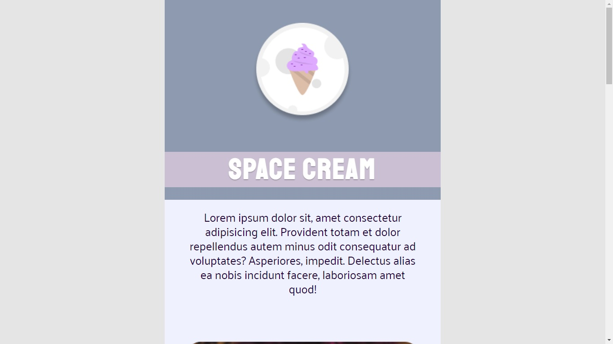

# Desafio Mobile First

Desafio do Stage03 que faz parte do Programa Explorer da Rocketseat  

A ideia agora é criar o Space Cream, nossa página de sorvetes, levando em consideração o Mobile first! 🍦  
Tente se atentar ao conteúdo que foi passado na aula. Portanto, nesse desafio, lembre-se de usar: 

- Mobile First;
- Unidade de medida flexível;
- Variáveis;
- Animações simples.

## Screenshots

[🔗 Clique aqui para acessar o Projeto](https://fabiovascao.github.io/Projeto-04-Mobile-First-Intermediario/)  
[🔗 Clique aqui para acessar o Figma](https://www.figma.com/file/kX005cUWOrUaeLwtba8w1v/Stage-03-Mobile-First-Copy?fuid=1151137169943796805)

## 🛠 Tecnologias

- HTML
- CSS
- Git e Github

## Autor

- [@FabioVascão](https://www.github.com/fabiovascao)